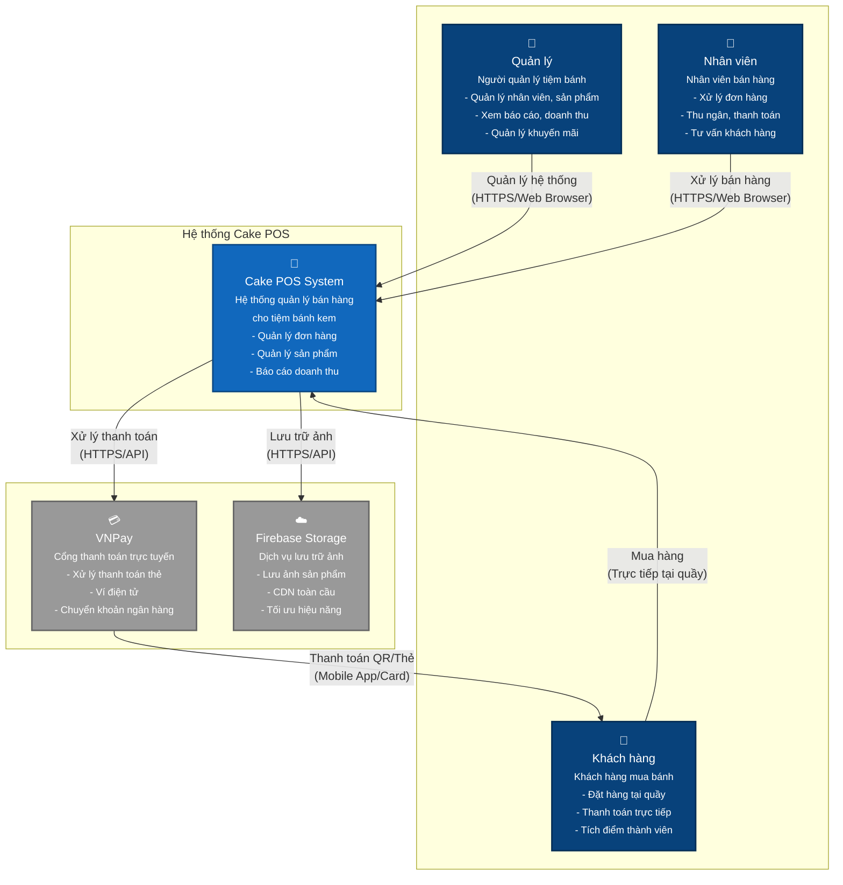
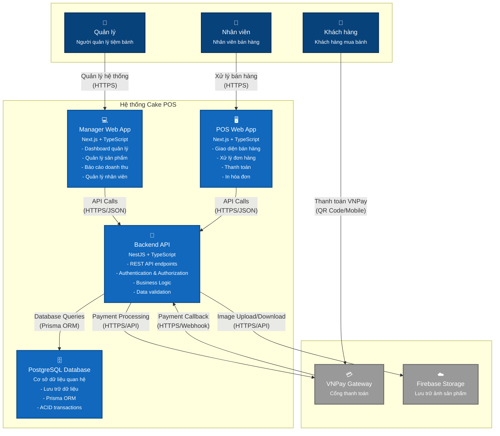
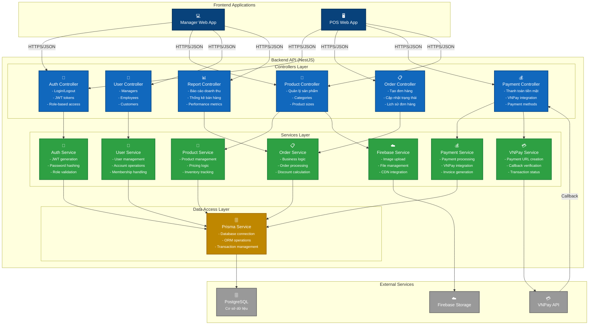
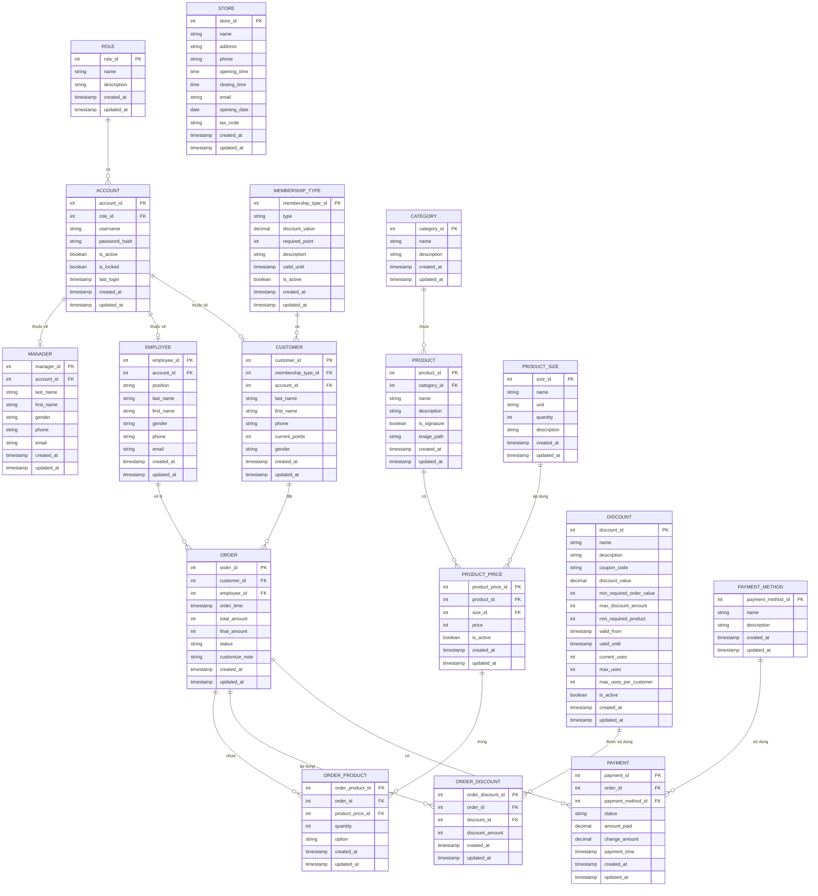

# Sơ đồ Kiến trúc C4 - Hệ thống Cake POS

## Tổng quan

Tài liệu này mô tả kiến trúc hệ thống Cake POS (Point of Sale) sử dụng mô hình C4 Model. Hệ thống được thiết kế để quản lý bán hàng cho tiệm bánh kem với các tính năng chính:

- **Quản lý sản phẩm và danh mục**
- **Xử lý đơn hàng và thanh toán** 
- **Quản lý nhân viên và khách hàng**
- **Báo cáo doanh thu và thống kê**
- **Tích hợp thanh toán VNPay**
- **Lưu trữ ảnh sản phẩm trên Firebase**

---

## 1. Sơ đồ Context Level - Tổng quan Hệ thống

### Mô tả Context Level:

#### Các Actor (Người dùng):
- **👤 Quản lý**: Chủ tiệm hoặc quản lý cấp cao
  - Quản lý toàn bộ hệ thống
  - Xem báo cáo doanh thu và thống kê
  - Quản lý nhân viên, sản phẩm, khuyến mãi
  
- **👤 Nhân viên**: Nhân viên bán hàng tại quầy
  - Sử dụng giao diện POS để phục vụ khách hàng
  - Xử lý đơn hàng và thanh toán
  - Tư vấn sản phẩm cho khách hàng
  
- **👤 Khách hàng**: Người mua bánh kem
  - Đặt hàng trực tiếp tại quầy
  - Thanh toán bằng tiền mặt hoặc VNPay
  - Tích lũy điểm thành viên

#### Hệ thống bên ngoài:
- **💳 VNPay**: Cổng thanh toán trực tuyến
  - Xử lý thanh toán thẻ, ví điện tử
  - Chuyển khoản ngân hàng
  - Thanh toán QR code
  
- **☁️ Firebase Storage**: Dịch vụ lưu trữ đám mây
  - Lưu trữ ảnh sản phẩm
  - CDN phân phối nội dung toàn cầu
  - Tối ưu hiệu năng tải ảnh

---

## 2. Sơ đồ Container Level - Chi tiết Thành phần

### Mô tả Container Level:

#### Frontend Applications:
- **💻 Manager Web App** (Next.js + TypeScript)
  - Dashboard tổng quan với biểu đồ và thống kê
  - Quản lý sản phẩm, danh mục, kích thước
  - Quản lý nhân viên, khách hàng, thành viên
  - Báo cáo doanh thu theo thời gian
  - Quản lý khuyến mãi và mã giảm giá
  
- **🖥️ POS Web App** (Next.js + TypeScript)
  - Giao diện bán hàng tối ưu cho thu ngân
  - Tìm kiếm và chọn sản phẩm nhanh chóng
  - Xử lý đơn hàng với nhiều sản phẩm
  - Áp dụng khuyến mãi và tính toán tự động
  - Thanh toán tiền mặt và VNPay
  - Tự động tạo và in hóa đơn

#### Backend Services:
- **🔧 Backend API** (NestJS + TypeScript)
  - RESTful API với OpenAPI documentation
  - JWT Authentication + Role-based Authorization
  - Input validation với class-validator
  - Business logic xử lý phức tạp
  - Integration với external services
  
- **🗄️ PostgreSQL Database**
  - Cơ sở dữ liệu quan hệ với ACID properties
  - Prisma ORM cho type-safe database access
  - Database migrations và seeding
  - Indexes tối ưu hiệu năng truy vấn

---

## 3. Sơ đồ Component Level - Chi tiết Backend API

### Mô tả Component Level:

#### Controllers Layer (Tầng điều khiển):
Xử lý HTTP requests và responses, validation đầu vào, authorization

- **🔐 AuthController**: 
  - Đăng nhập/đăng xuất
  - Tạo và verify JWT tokens
  - Role-based access control
  
- **📋 OrderController**:
  - Tạo đơn hàng mới
  - Cập nhật trạng thái đơn hàng
  - Lấy lịch sử và chi tiết đơn hàng
  
- **🧁 ProductController**:
  - CRUD operations cho sản phẩm
  - Quản lý categories và product sizes
  - Upload/update ảnh sản phẩm
  
- **💰 PaymentController**:
  - Xử lý thanh toán tiền mặt
  - Tích hợp VNPay payment gateway
  - Quản lý payment methods
  
- **👥 UserController**:
  - Quản lý Managers, Employees, Customers
  - CRUD operations cho các loại user
  - Quản lý membership types
  
- **📊 ReportController**:
  - Báo cáo doanh thu theo thời gian
  - Thống kê bán hàng theo sản phẩm
  - Performance metrics và analytics

#### Services Layer (Tầng dịch vụ):
Chứa business logic chính, xử lý các workflow phức tạp

- **🔐 AuthService**: JWT generation, password hashing, role validation
- **📋 OrderService**: Order processing, discount calculation, business rules
- **🧁 ProductService**: Product management, pricing logic, inventory
- **💰 PaymentService**: Payment processing, invoice generation
- **👥 UserService**: User management, account operations
- **💳 VNPayService**: VNPay integration, callback handling
- **☁️ FirebaseService**: File upload, image management

#### Data Access Layer (Tầng truy cập dữ liệu):
- **🗄️ PrismaService**: Type-safe database operations, transaction management

---

## 4. Sơ đồ Database Schema - Cấu trúc Dữ liệu

### Mô tả Database Schema:

#### 🔐 User Management (Quản lý người dùng):
- **ROLE**: Vai trò hệ thống (Manager, Employee, Customer)
- **ACCOUNT**: Tài khoản đăng nhập với username/password
- **MANAGER**: Thông tin quản lý cửa hàng
- **EMPLOYEE**: Thông tin nhân viên bán hàng
- **CUSTOMER**: Thông tin khách hàng và điểm tích lũy
- **MEMBERSHIP_TYPE**: Loại thành viên với quyền lợi khác nhau

#### 🧁 Product Management (Quản lý sản phẩm):
- **CATEGORY**: Danh mục sản phẩm (Bánh kem, Bánh ngọt, ...)
- **PRODUCT**: Thông tin sản phẩm và hình ảnh
- **PRODUCT_SIZE**: Kích thước sản phẩm (Nhỏ, Vừa, Lớn)
- **PRODUCT_PRICE**: Giá theo từng kích thước

#### 📋 Order Processing (Xử lý đơn hàng):
- **ORDER**: Đơn hàng với tổng tiền và trạng thái
- **ORDER_PRODUCT**: Chi tiết sản phẩm trong đơn hàng
- **ORDER_DISCOUNT**: Áp dụng khuyến mãi cho đơn hàng

#### 💰 Payment System (Hệ thống thanh toán):
- **PAYMENT_METHOD**: Phương thức thanh toán (Tiền mặt, VNPay)
- **PAYMENT**: Giao dịch thanh toán với trạng thái

#### 🎯 Business Logic (Logic nghiệp vụ):
- **DISCOUNT**: Quản lý mã giảm giá và khuyến mãi
- **STORE**: Thông tin cửa hàng và cấu hình

---

## Tổng kết Kiến trúc

### 🛠️ Công nghệ sử dụng:

#### Frontend:
- **Framework**: Next.js 15 với App Router
- **Language**: TypeScript cho type safety
- **UI Library**: Shadcn/UI + Radix UI components
- **Styling**: Tailwind CSS với responsive design
- **State Management**: Zustand cho global state
- **Forms**: React Hook Form + Zod validation

#### Backend:
- **Framework**: NestJS với decorators và dependency injection
- **Language**: TypeScript với strict mode
- **Database ORM**: Prisma với type-safe queries
- **Authentication**: JWT với role-based access control
- **Validation**: Class-validator cho DTO validation
- **Documentation**: Swagger/OpenAPI với tiếng Việt

#### Database:
- **Engine**: PostgreSQL với ACID properties
- **Migrations**: Prisma migrations
- **Indexing**: Optimized indexes cho performance
- **Backup**: Automated backup strategies

#### External Services:
- **Payment Gateway**: VNPay với webhook integration
- **File Storage**: Firebase Storage với CDN
- **Deployment**: Docker containers với orchestration

### ✅ Ưu điểm kiến trúc:

1. **📦 Modular Design**: 
   - Tách biệt rõ ràng các tầng và modules
   - Dễ bảo trì và mở rộng từng phần

2. **🛡️ Type Safety**: 
   - TypeScript end-to-end
   - Prisma generated types
   - API contract validation

3. **🚀 Scalable**: 
   - Microservices-ready architecture
   - Horizontal scaling capabilities
   - Caching strategies

4. **🔒 Security**: 
   - JWT authentication với refresh tokens
   - Role-based authorization
   - Input validation và sanitization
   - SQL injection protection

5. **⚡ Performance**: 
   - Database indexing tối ưu
   - Prisma query optimization
   - CDN cho static assets
   - Response caching

6. **🔧 Maintainability**:
   - Clean code principles
   - SOLID design patterns
   - Comprehensive documentation
   - Automated testing

### 🔄 Workflow chính:

#### Quy trình bán hàng:
1. **Đăng nhập**: Nhân viên đăng nhập vào POS
2. **Chọn sản phẩm**: Tìm và thêm sản phẩm vào đơn hàng
3. **Áp dụng khuyến mãi**: Nhập mã giảm giá (nếu có)
4. **Thanh toán**: Chọn phương thức (tiền mặt/VNPay)
5. **In hóa đơn**: Tự động tạo và in hóa đơn
6. **Cập nhật điểm**: Tích điểm cho khách hàng thành viên

#### Quy trình quản lý:
1. **Dashboard**: Xem tổng quan doanh thu và KPIs
2. **Quản lý sản phẩm**: CRUD operations với upload ảnh
3. **Quản lý nhân viên**: Tạo tài khoản và phân quyền
4. **Báo cáo**: Xuất báo cáo theo nhiều tiêu chí
5. **Cấu hình**: Thiết lập khuyến mãi và membership

### 🚀 Khả năng mở rộng:

#### Tính năng tương lai:
- **📱 Mobile App**: React Native cho khách hàng
- **🛒 E-commerce**: Online ordering và delivery
- **📊 Advanced Analytics**: Machine learning insights
- **🔔 Notifications**: Real-time notifications
- **📦 Inventory Management**: Quản lý kho nâng cao
- **🎯 CRM**: Customer relationship management

#### Tích hợp bổ sung:
- **💬 Chat Support**: Live chat với khách hàng
- **📧 Email Marketing**: Automated email campaigns  
- **📍 Multi-store**: Quản lý nhiều cửa hàng
- **🚚 Delivery**: Tích hợp với dịch vụ giao hàng
- **📱 QR Menu**: QR code menu scanning
- **🤖 AI**: Chatbot và recommendation system

Kiến trúc này đảm bảo hệ thống Cake POS hoạt động hiệu quả, bảo mật và có thể phát triển bền vững trong tương lai. 