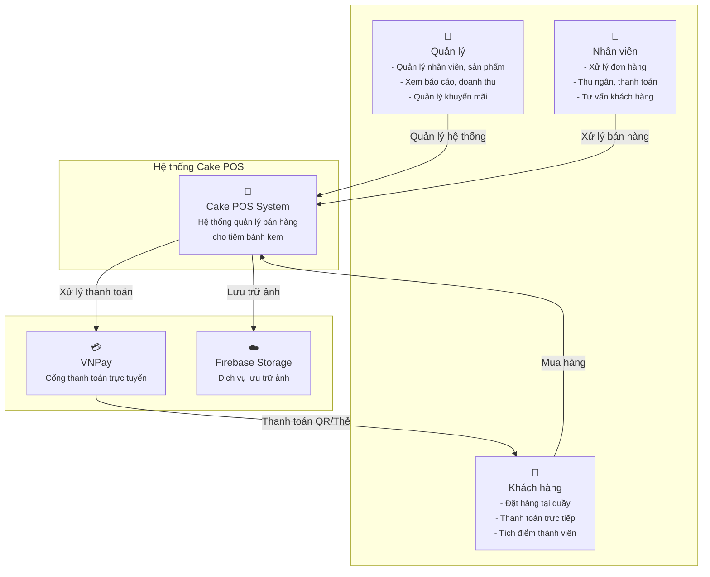
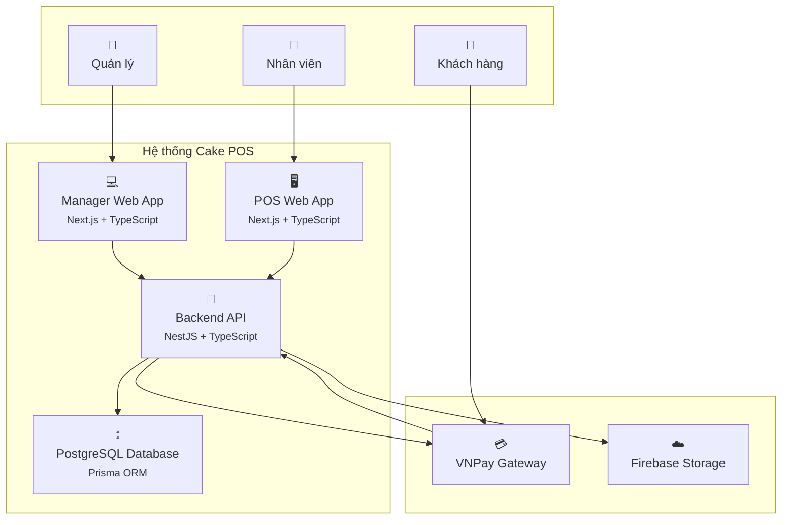
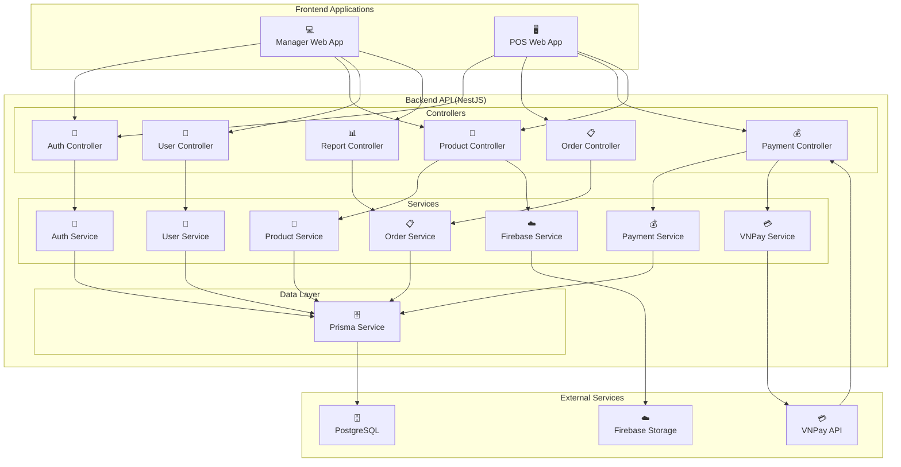
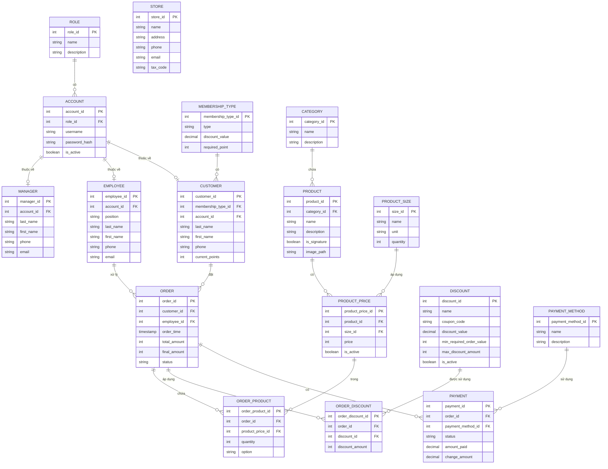

# Sơ đồ Kiến trúc C4 - Hệ thống Cake POS

## 1. Context Level - Tổng quan Hệ thống

## 2. Container Level - Chi tiết Thành phần

## 3. Component Level - Chi tiết Backend API

## 4. Database Schema

## Tổng kết

### Công nghệ sử dụng:
- **Frontend**: Next.js 15 + TypeScript + Shadcn/UI
- **Backend**: NestJS + TypeScript + Prisma ORM  
- **Database**: PostgreSQL
- **External**: VNPay + Firebase Storage

### Ưu điểm:
- **Modular**: Tách biệt rõ ràng các thành phần
- **Type Safety**: TypeScript end-to-end
- **Scalable**: Có thể mở rộng dễ dàng
- **Secure**: JWT + Role-based authentication
- **Performance**: Database indexing + caching

### Workflow chính:
1. **Đăng nhập** → **Chọn sản phẩm** → **Thanh toán** → **In hóa đơn**
2. **Dashboard** → **Quản lý** → **Báo cáo** → **Cấu hình** 