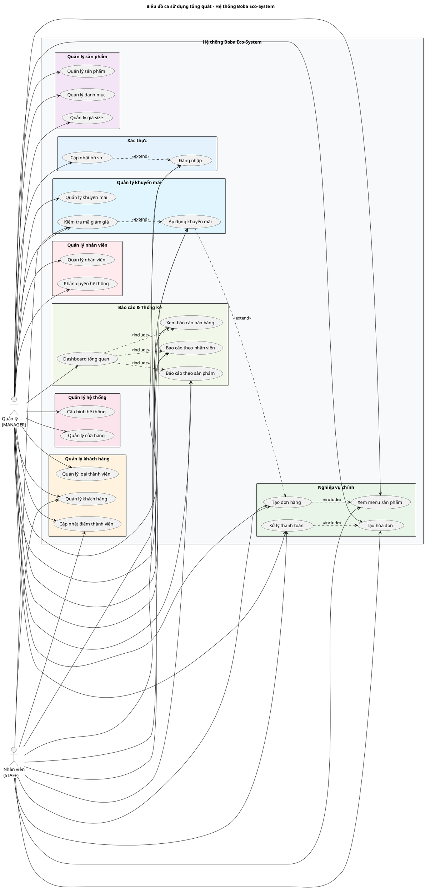
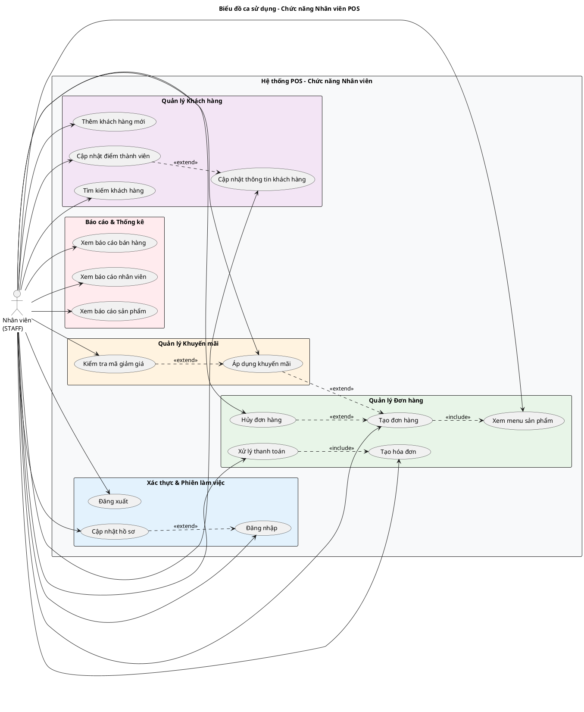
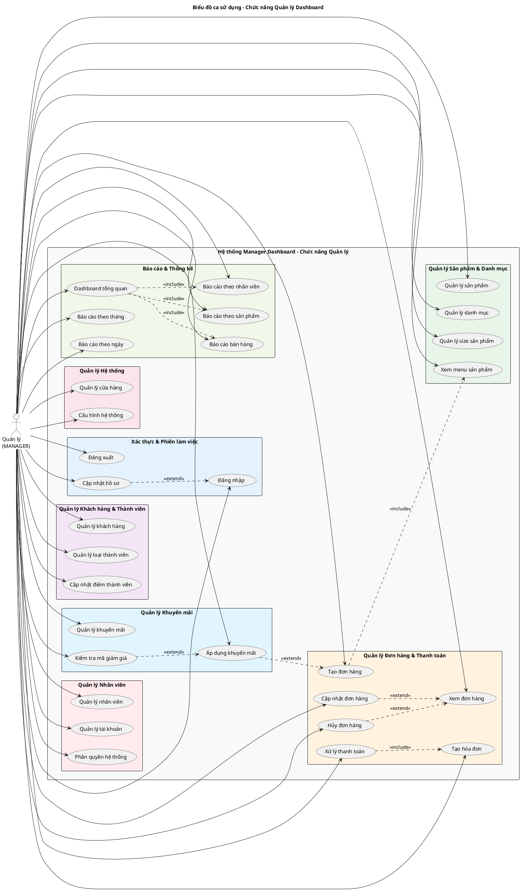
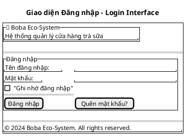
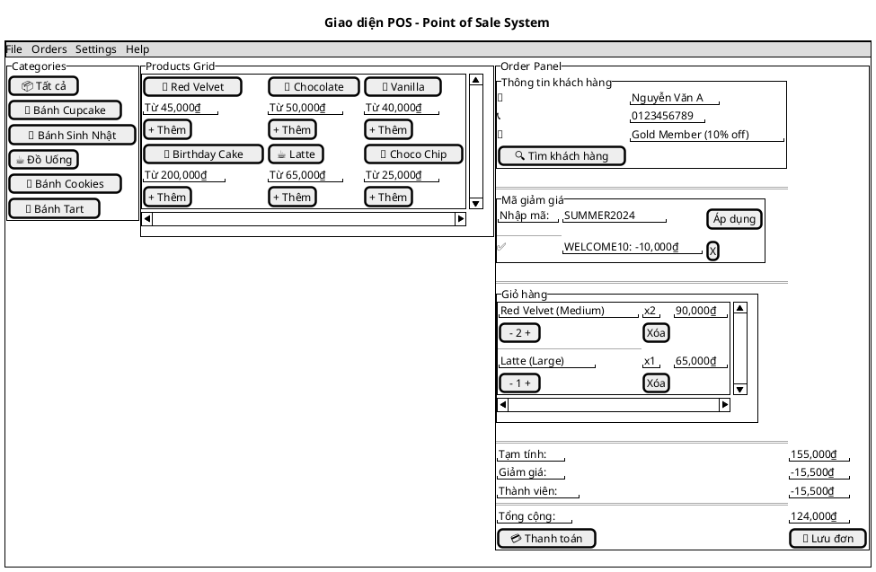
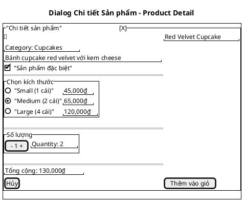
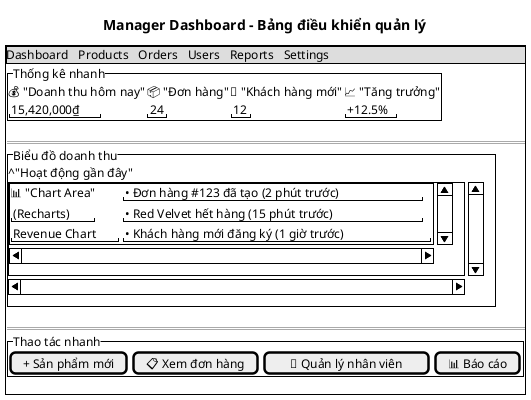

# Chương 3: Phân tích thiết kế

## 3.1 Xác định yêu cầu nghiệp vụ

### 3.1.1 Xác định mô tả các tác nhân

| Tác nhân | Mô tả |
|----------|-------|
| Nhân viên (STAFF) | Xử lý đơn hàng tại POS, quản lý khách hàng, xử lý thanh toán, áp dụng khuyến mãi, xem báo cáo bán hàng, quản lý sản phẩm cơ bản |
| Quản lý (MANAGER) | Toàn quyền quản lý hệ thống qua Dashboard: quản lý nhân viên, sản phẩm, khuyến mãi, báo cáo tổng quan, cửa hàng, cấu hình hệ thống |

### 3.1.2 Xây dựng bản thuật ngữ

| STT | Tiếng Anh | Tiếng Việt | Giải thích |
|-----|-----------|------------|------------|
| 1 | Product | Sản phẩm | Các loại trà sữa, đồ uống với nhiều size và giá khác nhau |
| 2 | Category | Danh mục | Phân loại sản phẩm (trà sữa, trà trái cây, topping, etc.) |
| 3 | Order | Đơn hàng | Đơn đặt hàng của khách hàng với trạng thái PROCESSING/COMPLETED/CANCELLED |
| 4 | Customer | Khách hàng | Người mua hàng, có thể có tài khoản và tham gia chương trình thành viên |
| 5 | Employee | Nhân viên | Nhân viên bán hàng với vai trò STAFF |
| 6 | Manager | Quản lý | Người quản lý cửa hàng với vai trò MANAGER |
| 7 | Membership Type | Loại thành viên | Các cấp độ thành viên với ưu đãi và điểm yêu cầu khác nhau |
| 8 | Discount | Khuyến mãi | Chương trình giảm giá với mã coupon và điều kiện áp dụng |
| 9 | Payment | Thanh toán | Xử lý thanh toán qua CASH hoặc STRIPE |
| 10 | Invoice | Hóa đơn | Hóa đơn điện tử được tạo sau khi hoàn thành đơn hàng |
| 11 | Store | Cửa hàng | Thông tin cửa hàng (địa chỉ, giờ mở cửa, thông tin liên hệ) |
| 12 | Product Size | Kích thước sản phẩm | Các size khác nhau của sản phẩm (S, M, L) với giá riêng |

### 3.1.3 Xác định và mô tả các ca sử dụng

| STT | Ca sử dụng | Tác nhân | Mô tả | Dữ liệu liên quan |
|-----|------------|----------|-------|-------------------|
| 1 | Xem menu sản phẩm | CUSTOMER, STAFF, MANAGER | Xem danh sách sản phẩm theo danh mục với giá theo size | Product, Category, ProductSize |
| 2 | Tạo đơn hàng | CUSTOMER, STAFF, MANAGER | Tạo đơn hàng mới với sản phẩm, áp dụng khuyến mãi | Order, Product, Discount |
| 3 | Xử lý thanh toán | STAFF, MANAGER | Xử lý thanh toán đơn hàng qua tiền mặt hoặc Stripe | Payment, Order |
| 4 | Quản lý khách hàng | STAFF, MANAGER | Tạo, cập nhật thông tin khách hàng và thành viên | Customer, MembershipType |
| 5 | Quản lý sản phẩm | MANAGER, STAFF | Thêm, sửa, xóa sản phẩm và cập nhật giá theo size | Product, Category, ProductSize |
| 6 | Quản lý nhân viên | MANAGER | Tạo, cập nhật, khóa tài khoản nhân viên | Employee, Account |
| 7 | Quản lý khuyến mãi | MANAGER | Tạo, cập nhật chương trình khuyến mãi và mã coupon | Discount |
| 8 | Xem báo cáo | MANAGER, STAFF | Xem báo cáo doanh thu, hiệu suất nhân viên, sản phẩm bán chạy | Reports |
| 9 | Quản lý loại thành viên | MANAGER | Tạo, cập nhật các cấp độ thành viên và ưu đãi | MembershipType |
| 10 | Quản lý cửa hàng | MANAGER | Cập nhật thông tin cửa hàng | Store |

### 3.1.4 Mô tả tổng quan các ca sử dụng

Hệ thống Boba Eco-System bao gồm các ca sử dụng chính được phân chia theo từng module:

**Module Xác thực & Phân quyền:**

- Đăng nhập/Đăng xuất hệ thống
- Quản lý token và phiên làm việc
- Cập nhật thông tin cá nhân

**Module Quản lý Sản phẩm:**

- Xem menu sản phẩm và danh mục
- CRUD sản phẩm, danh mục, kích thước
- Quản lý giá theo size

**Module Quản lý Đơn hàng:**

- Tạo và xử lý đơn hàng
- Áp dụng khuyến mãi
- Xử lý thanh toán (CASH/STRIPE)
- Tạo hóa đơn

**Module Quản lý Khách hàng:**

- CRUD thông tin khách hàng
- Quản lý thành viên và điểm tích lũy
- Quản lý loại thành viên

**Module Báo cáo & Thống kê:**

- Báo cáo doanh thu theo thời gian
- Báo cáo hiệu suất nhân viên
- Báo cáo sản phẩm bán chạy

**Module Quản lý Hệ thống:**

- Quản lý nhân viên và tài khoản
- Quản lý cửa hàng
- Quản lý phương thức thanh toán

### 3.1.5 Xây dựng biểu đồ tuần tự

#### Biểu đồ tuần tự đăng nhập


#### Biểu đồ tuần tự tạo đơn hàng


#### Biểu đồ tuần tự xử lý thanh toán


#### Biểu đồ tuần tự quản lý sản phẩm


#### Biểu đồ tuần tự quản lý khách hàng


#### Biểu đồ tuần tự xem báo cáo


#### Biểu đồ tuần tự quản lý nhân viên


#### Biểu đồ tuần tự quản lý khuyến mãi


### 3.1.6 Xây dựng biểu đồ hoạt động (state diagram)

#### Biểu đồ trạng thái đơn hàng


#### Biểu đồ trạng thái thanh toán


#### Biểu đồ hoạt động quản lý sản phẩm


#### Biểu đồ hoạt động xử lý đơn hàng


## 3.2 Xác định yêu cầu hệ thống

### 3.2.1 Xác định và mô tả các tác nhân

**- Nhân viên (STAFF):**

- Xử lý đơn hàng tại quầy POS
- Quản lý thông tin khách hàng và thành viên
- Xử lý thanh toán (tiền mặt/thẻ) và tạo hóa đơn
- Áp dụng mã khuyến mãi cho đơn hàng
- Xem menu sản phẩm và quản lý sản phẩm cơ bản
- Xem báo cáo bán hàng cá nhân

**- Quản lý (MANAGER):**

- Toàn quyền quản lý hệ thống qua Manager Dashboard
- Quản lý nhân viên, tài khoản và phân quyền
- Quản lý sản phẩm, danh mục, giá cả toàn quyền
- Quản lý chương trình khuyến mãi và mã giảm giá
- Xem tất cả báo cáo: doanh thu, hiệu suất nhân viên, sản phẩm bán chạy
- Quản lý thông tin cửa hàng, loại thành viên và cấu hình hệ thống

### 3.2.2 Xác định và mô tả các ca sử dụng

#### U1. Đăng nhập hệ thống

- STAFF: Đăng nhập vào hệ thống POS để xử lý đơn hàng
- MANAGER: Đăng nhập vào Manager Dashboard để quản lý hệ thống

#### U2. Quản lý sản phẩm

- MANAGER: Toàn quyền CRUD sản phẩm, danh mục, giá size
- STAFF: Xem menu sản phẩm và quản lý sản phẩm cơ bản

#### U3. Xử lý đơn hàng

- STAFF: Tạo đơn hàng tại POS, xử lý và cập nhật trạng thái đơn hàng
- MANAGER: Giám sát và quản lý tất cả đơn hàng

#### U4. Quản lý khách hàng

- STAFF: Tạo và quản lý thông tin khách hàng, quản lý thành viên
- MANAGER: Toàn quyền quản lý khách hàng và loại thành viên

#### U5. Xử lý thanh toán

- STAFF: Xử lý thanh toán qua CASH hoặc STRIPE, tạo hóa đơn
- MANAGER: Quản lý và giám sát tất cả giao dịch thanh toán

#### U6. Quản lý khuyến mãi

- MANAGER: Tạo và quản lý chương trình khuyến mãi, mã giảm giá
- STAFF: Áp dụng mã khuyến mãi cho đơn hàng

#### U7. Xem báo cáo

- MANAGER: Xem tất cả báo cáo (doanh thu, hiệu suất nhân viên, sản phẩm bán chạy)
- STAFF: Xem báo cáo bán hàng cá nhân

#### U8. Quản lý nhân viên

- MANAGER: Tạo, cập nhật, khóa tài khoản nhân viên, phân quyền

#### U9. Quản lý loại thành viên

- MANAGER: Tạo và cập nhật các cấp độ thành viên, điểm tích lũy

#### U10. Quản lý cửa hàng

- MANAGER: Cập nhật thông tin cửa hàng, cấu hình hệ thống

### 3.2.3 Xây dựng biểu đồ ca sử dụng

#### a. Biểu đồ ca tổng quát



#### b. Biểu đồ ca phân rã cho Nhân viên (STAFF)



#### c. Biểu đồ ca phân rã cho Quản lý (MANAGER)



#### d. Biểu đồ ca tổng hợp theo backend thực tế

```plantuml
@startuml
title Biểu đồ ca sử dụng tổng hợp - Hệ thống Boba Eco-System (Backend-based)

left to right direction
skinparam packageStyle rectangle

' Actors
actor "Nhân viên\n(STAFF)" as Staff
actor "Quản lý\n(MANAGER)" as Manager

rectangle "Hệ thống Boba Eco-System" #f8f9fa {

  ' Authentication Module
  package "Auth Module" #e3f2fd {
    usecase "Đăng nhập (Login)" as Login
    usecase "Cập nhật hồ sơ (Update Profile)" as UpdateProfile
  }

  ' Product Module
  package "Product Module" #e8f5e8 {
    usecase "Quản lý sản phẩm (Products)" as ManageProducts
    usecase "Quản lý danh mục (Categories)" as ManageCategories
    usecase "Quản lý size (Product Sizes)" as ManageProductSizes
    usecase "Xem menu sản phẩm" as ViewProducts
  }

  ' Order Module
  package "Order Module" #fff3e0 {
    usecase "Tạo đơn hàng (Create Order)" as CreateOrder
    usecase "Xem đơn hàng (View Orders)" as ViewOrders
    usecase "Cập nhật đơn hàng (Update Order)" as UpdateOrder
    usecase "Hủy đơn hàng (Cancel Order)" as CancelOrder
    usecase "Kiểm tra khuyến mãi (Validate Discounts)" as ValidateDiscounts
  }

  ' Payment Module
  package "Payment Module" #f3e5f5 {
    usecase "Xử lý thanh toán (Process Payment)" as ProcessPayment
    usecase "Thanh toán Stripe" as StripePayment
    usecase "Thanh toán tiền mặt (Cash)" as CashPayment
  }

  ' Invoice Module
  package "Invoice Module" #e1f5fe {
    usecase "Tạo hóa đơn HTML" as CreateInvoiceHTML
    usecase "Tạo hóa đơn PDF" as CreateInvoicePDF
    usecase "Xem dữ liệu hóa đơn" as ViewInvoiceData
  }

  ' Customer Module
  package "Customer Module" #ffebee {
    usecase "Quản lý khách hàng (Customers)" as ManageCustomers
    usecase "Quản lý loại thành viên (Membership Types)" as ManageMembershipTypes
  }

  ' Employee Module
  package "Employee Module" #f1f8e9 {
    usecase "Quản lý nhân viên (Employees)" as ManageEmployees
    usecase "Quản lý tài khoản (Accounts)" as ManageAccounts
    usecase "Quản lý quyền (Roles)" as ManageRoles
  }

  ' Discount Module
  package "Discount Module" #fce4ec {
    usecase "Quản lý khuyến mãi (Discounts)" as ManageDiscounts
    usecase "Áp dụng khuyến mãi" as ApplyDiscounts
  }

  ' Reports Module
  package "Reports Module" #e8f5e8 {
    usecase "Báo cáo bán hàng (Sales Report)" as SalesReport
    usecase "Báo cáo theo tháng (Monthly Report)" as MonthlyReport
    usecase "Báo cáo theo ngày (Daily Report)" as DailyReport
    usecase "Báo cáo nhân viên (Employee Report)" as EmployeeReport
    usecase "Báo cáo sản phẩm (Product Report)" as ProductReport
  }

  ' Store Module
  package "Store Module" #fff3e0 {
    usecase "Quản lý cửa hàng (Store Management)" as ManageStore
  }
}

' Staff associations (operational access)
Staff --> Login
Staff --> UpdateProfile
Staff --> ViewProducts
Staff --> CreateOrder
Staff --> ViewOrders
Staff --> UpdateOrder
Staff --> CancelOrder
Staff --> ValidateDiscounts
Staff --> ProcessPayment
Staff --> CashPayment
Staff --> StripePayment
Staff --> ViewInvoiceData
Staff --> ManageCustomers
Staff --> ApplyDiscounts
Staff --> SalesReport
Staff --> EmployeeReport
Staff --> ProductReport

' Manager associations (full access)
Manager --> Login
Manager --> UpdateProfile
Manager --> ManageProducts
Manager --> ManageCategories
Manager --> ManageProductSizes
Manager --> ViewProducts
Manager --> CreateOrder
Manager --> ViewOrders
Manager --> UpdateOrder
Manager --> CancelOrder
Manager --> ValidateDiscounts
Manager --> ProcessPayment
Manager --> CashPayment
Manager --> StripePayment
Manager --> CreateInvoiceHTML
Manager --> CreateInvoicePDF
Manager --> ViewInvoiceData
Manager --> ManageCustomers
Manager --> ManageMembershipTypes
Manager --> ManageEmployees
Manager --> ManageAccounts
Manager --> ManageRoles
Manager --> ManageDiscounts
Manager --> ApplyDiscounts
Manager --> SalesReport
Manager --> MonthlyReport
Manager --> DailyReport
Manager --> EmployeeReport
Manager --> ProductReport
Manager --> ManageStore

' Include relationships (mandatory behavior)
' Use case lớn bao gồm use case nhỏ như một phần không thể thiếu
CreateOrder ..> ViewProducts : <<include>>
ProcessPayment ..> CreateInvoiceHTML : <<include>>

' Extend relationships (optional behavior)
' Use case bổ sung chức năng cho use case có sẵn trong điều kiện nhất định
ApplyDiscounts ..> CreateOrder : <<extend>>
ValidateDiscounts ..> ApplyDiscounts : <<extend>>
UpdateProfile ..> Login : <<extend>>
CancelOrder ..> ViewOrders : <<extend>>
UpdateOrder ..> ViewOrders : <<extend>>
StripePayment ..> ProcessPayment : <<extend>>
CashPayment ..> ProcessPayment : <<extend>>
CreateInvoicePDF ..> CreateInvoiceHTML : <<extend>>

@enduml
```



### 3.2.4 Xây dựng kịch bản

#### Kịch bản 1: Đăng nhập hệ thống

<table border="1">
<tr><td><strong>Tên Use Case</strong></td><td>Đăng nhập</td></tr>
<tr><td><strong>Tác nhân chính</strong></td><td>Người dùng hệ thống</td></tr>
<tr><td><strong>Điều kiện trước</strong></td><td>Người dùng đã có tài khoản để đăng nhập hệ thống</td></tr>
<tr><td><strong>Đảm bảo tối thiểu</strong></td><td>Hệ thống cho phép người dùng đăng nhập lại</td></tr>
<tr><td><strong>Điều kiện sau</strong></td><td>Người dùng đăng nhập được vào hệ thống</td></tr>
<tr><td><strong>Chuỗi sự kiện chính</strong></td><td>
1. Người dùng chọn chức năng đăng nhập trên giao diện chính của hệ thống<br/>
2. Hệ thống hiển thị form đăng nhập<br/>
3. Người dùng nhập tài khoản và mật khẩu của mình<br/>
4. Hệ thống kiểm tra tính hợp lệ của tài khoản và mật khẩu<br/>
5. Hệ thống tạo JWT token và refresh token<br/>
6. Hệ thống hiển thị giao diện chính tương ứng với vai trò của người dùng
</td></tr>
<tr><td><strong>Ngoại lệ:</strong></td><td>
4.1. Người dùng nhập tài khoản hay mật khẩu không chính xác<br/>
&nbsp;&nbsp;&nbsp;&nbsp;4.1.1. Hệ thống thông báo lỗi và yêu cầu nhập lại<br/>
4.2. Tài khoản người dùng đăng nhập không tồn tại<br/>
&nbsp;&nbsp;&nbsp;&nbsp;4.2.1. Hệ thống thông báo lỗi và yêu cầu người sử dụng đăng ký<br/>
4.3. Tài khoản bị khóa<br/>
&nbsp;&nbsp;&nbsp;&nbsp;4.3.1. Hệ thống thông báo tài khoản bị vô hiệu hóa
</td></tr>
</table>

#### Kịch bản 2: Tạo đơn hàng

<table border="1">
<tr><td><strong>Tên Use Case</strong></td><td>Tạo đơn hàng</td></tr>
<tr><td><strong>Tác nhân chính</strong></td><td>CUSTOMER, STAFF, MANAGER</td></tr>
<tr><td><strong>Điều kiện trước</strong></td><td>Người dùng đã đăng nhập và có sản phẩm trong hệ thống</td></tr>
<tr><td><strong>Đảm bảo tối thiểu</strong></td><td>Hệ thống lưu trữ thông tin đơn hàng</td></tr>
<tr><td><strong>Điều kiện sau</strong></td><td>Đơn hàng được tạo thành công với trạng thái PROCESSING</td></tr>
<tr><td><strong>Chuỗi sự kiện chính</strong></td><td>
1. Người dùng truy cập menu sản phẩm<br/>
2. Hệ thống hiển thị danh sách sản phẩm theo danh mục<br/>
3. Người dùng chọn sản phẩm và size mong muốn<br/>
4. Người dùng xác định số lượng cho từng sản phẩm<br/>
5. Hệ thống tính toán tổng tiền dựa trên giá sản phẩm<br/>
6. Người dùng áp dụng mã khuyến mãi (nếu có)<br/>
7. Hệ thống kiểm tra và áp dụng khuyến mãi hợp lệ<br/>
8. Hệ thống tính toán số tiền cuối cùng<br/>
9. Người dùng xác nhận tạo đơn hàng<br/>
10. Hệ thống tạo đơn hàng với trạng thái PROCESSING
</td></tr>
<tr><td><strong>Ngoại lệ:</strong></td><td>
6.1. Mã khuyến mãi không hợp lệ hoặc hết hạn<br/>
&nbsp;&nbsp;&nbsp;&nbsp;6.1.1. Hệ thống thông báo lỗi và không áp dụng khuyến mãi<br/>
3.1. Sản phẩm không có sẵn hoặc hết hàng<br/>
&nbsp;&nbsp;&nbsp;&nbsp;3.1.1. Hệ thống thông báo và đề xuất sản phẩm thay thế<br/>
7.1. Khuyến mãi không đủ điều kiện áp dụng<br/>
&nbsp;&nbsp;&nbsp;&nbsp;7.1.1. Hệ thống thông báo điều kiện cần thiết
</td></tr>
</table>

#### Kịch bản 3: Xử lý thanh toán

<table border="1">
<tr><td><strong>Tên Use Case</strong></td><td>Xử lý thanh toán</td></tr>
<tr><td><strong>Tác nhân chính</strong></td><td>STAFF, MANAGER</td></tr>
<tr><td><strong>Điều kiện trước</strong></td><td>Có đơn hàng với trạng thái PROCESSING</td></tr>
<tr><td><strong>Đảm bảo tối thiểu</strong></td><td>Hệ thống ghi nhận giao dịch thanh toán</td></tr>
<tr><td><strong>Điều kiện sau</strong></td><td>Đơn hàng được cập nhật trạng thái COMPLETED và tạo hóa đơn</td></tr>
<tr><td><strong>Chuỗi sự kiện chính</strong></td><td>
1. Nhân viên chọn đơn hàng cần xử lý thanh toán<br/>
2. Hệ thống hiển thị thông tin chi tiết đơn hàng<br/>
3. Nhân viên xác nhận thông tin với khách hàng<br/>
4. Nhân viên chọn phương thức thanh toán (CASH hoặc STRIPE)<br/>
5. Hệ thống xử lý thanh toán theo phương thức đã chọn<br/>
6. Hệ thống tạo bản ghi payment với trạng thái PAID<br/>
7. Hệ thống cập nhật trạng thái đơn hàng thành COMPLETED<br/>
8. Hệ thống tạo và in hóa đơn cho khách hàng<br/>
9. Hệ thống cập nhật điểm thành viên (nếu có)
</td></tr>
<tr><td><strong>Ngoại lệ:</strong></td><td>
5.1. Thanh toán qua STRIPE thất bại<br/>
&nbsp;&nbsp;&nbsp;&nbsp;5.1.1. Hệ thống thông báo lỗi và yêu cầu thử lại hoặc chọn phương thức khác<br/>
5.2. Không đủ tiền mặt<br/>
&nbsp;&nbsp;&nbsp;&nbsp;5.2.1. Nhân viên thông báo với khách hàng và yêu cầu bổ sung<br/>
6.1. Lỗi khi tạo payment record<br/>
&nbsp;&nbsp;&nbsp;&nbsp;6.1.1. Hệ thống rollback và thông báo lỗi hệ thống
</td></tr>
</table>

#### Kịch bản 4: Quản lý sản phẩm

<table border="1">
<tr><td><strong>Tên Use Case</strong></td><td>Quản lý sản phẩm</td></tr>
<tr><td><strong>Tác nhân chính</strong></td><td>MANAGER, STAFF</td></tr>
<tr><td><strong>Điều kiện trước</strong></td><td>Người dùng đã đăng nhập với quyền phù hợp</td></tr>
<tr><td><strong>Đảm bảo tối thiểu</strong></td><td>Hệ thống lưu trữ thông tin sản phẩm</td></tr>
<tr><td><strong>Điều kiện sau</strong></td><td>Sản phẩm được quản lý thành công</td></tr>
<tr><td><strong>Chuỗi sự kiện chính</strong></td><td>
1. Người dùng truy cập module quản lý sản phẩm<br/>
2. Hệ thống hiển thị danh sách sản phẩm hiện có<br/>
3. Người dùng chọn thao tác (tạo mới/chỉnh sửa/xóa)<br/>
4. Hệ thống hiển thị form tương ứng<br/>
5. Người dùng nhập thông tin sản phẩm (tên, mô tả, danh mục, giá theo size)<br/>
6. Hệ thống validate thông tin đầu vào<br/>
7. Hệ thống lưu thông tin sản phẩm vào database<br/>
8. Hệ thống cập nhật danh sách sản phẩm<br/>
9. Hệ thống tạo các bản ghi product_size tương ứng
</td></tr>
<tr><td><strong>Ngoại lệ:</strong></td><td>
6.1. Thông tin sản phẩm không hợp lệ<br/>
&nbsp;&nbsp;&nbsp;&nbsp;6.1.1. Hệ thống thông báo lỗi và yêu cầu nhập lại<br/>
5.1. Tên sản phẩm đã tồn tại<br/>
&nbsp;&nbsp;&nbsp;&nbsp;5.1.1. Hệ thống thông báo và yêu cầu chọn tên khác<br/>
3.1. STAFF cố gắng xóa sản phẩm<br/>
&nbsp;&nbsp;&nbsp;&nbsp;3.1.1. Hệ thống từ chối và thông báo không đủ quyền
</td></tr>
</table>

#### Kịch bản 5: Quản lý khách hàng

<table border="1">
<tr><td><strong>Tên Use Case</strong></td><td>Quản lý khách hàng</td></tr>
<tr><td><strong>Tác nhân chính</strong></td><td>STAFF, MANAGER</td></tr>
<tr><td><strong>Điều kiện trước</strong></td><td>Người dùng đã đăng nhập với quyền phù hợp</td></tr>
<tr><td><strong>Đảm bảo tối thiểu</strong></td><td>Hệ thống lưu trữ thông tin khách hàng</td></tr>
<tr><td><strong>Điều kiện sau</strong></td><td>Khách hàng được quản lý thành công</td></tr>
<tr><td><strong>Chuỗi sự kiện chính</strong></td><td>
1. Người dùng truy cập module quản lý khách hàng<br/>
2. Hệ thống hiển thị danh sách khách hàng<br/>
3. Người dùng chọn thao tác (tạo mới/chỉnh sửa/xem chi tiết)<br/>
4. Hệ thống hiển thị form tương ứng<br/>
5. Người dùng nhập/cập nhật thông tin khách hàng<br/>
6. Hệ thống validate thông tin đầu vào<br/>
7. Hệ thống lưu thông tin khách hàng<br/>
8. Hệ thống tự động gán loại thành viên phù hợp<br/>
9. Hệ thống cập nhật điểm thành viên nếu cần
</td></tr>
<tr><td><strong>Ngoại lệ:</strong></td><td>
6.1. Thông tin khách hàng không hợp lệ<br/>
&nbsp;&nbsp;&nbsp;&nbsp;6.1.1. Hệ thống thông báo lỗi validation<br/>
5.1. Email hoặc số điện thoại đã tồn tại<br/>
&nbsp;&nbsp;&nbsp;&nbsp;5.1.1. Hệ thống thông báo trùng lặp thông tin<br/>
8.1. Không tìm thấy loại thành viên phù hợp<br/>
&nbsp;&nbsp;&nbsp;&nbsp;8.1.1. Hệ thống gán loại thành viên mặc định
</td></tr>
</table>

#### Kịch bản 6: Xem báo cáo

<table border="1">
<tr><td><strong>Tên Use Case</strong></td><td>Xem báo cáo</td></tr>
<tr><td><strong>Tác nhân chính</strong></td><td>MANAGER, STAFF</td></tr>
<tr><td><strong>Điều kiện trước</strong></td><td>Người dùng đã đăng nhập và có dữ liệu bán hàng</td></tr>
<tr><td><strong>Đảm bảo tối thiểu</strong></td><td>Hệ thống hiển thị báo cáo theo quyền hạn</td></tr>
<tr><td><strong>Điều kiện sau</strong></td><td>Người dùng xem được báo cáo phù hợp</td></tr>
<tr><td><strong>Chuỗi sự kiện chính</strong></td><td>
1. Người dùng truy cập module báo cáo<br/>
2. Hệ thống hiển thị các loại báo cáo có sẵn theo quyền hạn<br/>
3. Người dùng chọn loại báo cáo (doanh thu/nhân viên/sản phẩm)<br/>
4. Người dùng thiết lập tham số báo cáo (thời gian, nhân viên cụ thể)<br/>
5. Hệ thống truy vấn dữ liệu từ database<br/>
6. Hệ thống tính toán và tạo báo cáo<br/>
7. Hệ thống hiển thị báo cáo dưới dạng biểu đồ và bảng<br/>
8. Người dùng có thể xuất báo cáo ra file
</td></tr>
<tr><td><strong>Ngoại lệ:</strong></td><td>
5.1. Không có dữ liệu trong khoảng thời gian được chọn<br/>
&nbsp;&nbsp;&nbsp;&nbsp;5.1.1. Hệ thống thông báo và đề xuất chọn khoảng thời gian khác<br/>
3.1. STAFF cố gắng truy cập báo cáo nhân viên<br/>
&nbsp;&nbsp;&nbsp;&nbsp;3.1.1. Hệ thống từ chối truy cập và thông báo không đủ quyền<br/>
6.1. Lỗi khi tính toán dữ liệu báo cáo<br/>
&nbsp;&nbsp;&nbsp;&nbsp;6.1.1. Hệ thống thông báo lỗi và yêu cầu thử lại
</td></tr>
</table>

#### Kịch bản 7: Quản lý nhân viên

<table border="1">
<tr><td><strong>Tên Use Case</strong></td><td>Quản lý nhân viên</td></tr>
<tr><td><strong>Tác nhân chính</strong></td><td>MANAGER</td></tr>
<tr><td><strong>Điều kiện trước</strong></td><td>Người dùng đã đăng nhập với quyền MANAGER</td></tr>
<tr><td><strong>Đảm bảo tối thiểu</strong></td><td>Hệ thống lưu trữ thông tin nhân viên</td></tr>
<tr><td><strong>Điều kiện sau</strong></td><td>Nhân viên được quản lý thành công</td></tr>
<tr><td><strong>Chuỗi sự kiện chính</strong></td><td>
1. Manager truy cập module quản lý nhân viên<br/>
2. Hệ thống hiển thị danh sách nhân viên<br/>
3. Manager chọn thao tác (tạo mới/chỉnh sửa/khóa tài khoản)<br/>
4. Hệ thống hiển thị form tương ứng<br/>
5. Manager nhập/cập nhật thông tin nhân viên<br/>
6. Hệ thống validate thông tin đầu vào<br/>
7. Hệ thống tạo/cập nhật tài khoản đăng nhập<br/>
8. Hệ thống lưu thông tin nhân viên<br/>
9. Hệ thống gửi thông tin tài khoản cho nhân viên mới
</td></tr>
<tr><td><strong>Ngoại lệ:</strong></td><td>
6.1. Thông tin nhân viên không hợp lệ<br/>
&nbsp;&nbsp;&nbsp;&nbsp;6.1.1. Hệ thống thông báo lỗi validation<br/>
5.1. Email hoặc username đã tồn tại<br/>
&nbsp;&nbsp;&nbsp;&nbsp;5.1.1. Hệ thống thông báo trùng lặp<br/>
7.1. Lỗi khi tạo tài khoản<br/>
&nbsp;&nbsp;&nbsp;&nbsp;7.1.1. Hệ thống rollback và thông báo lỗi
</td></tr>
</table>

#### Kịch bản 8: Quản lý khuyến mãi

<table border="1">
<tr><td><strong>Tên Use Case</strong></td><td>Quản lý khuyến mãi</td></tr>
<tr><td><strong>Tác nhân chính</strong></td><td>MANAGER</td></tr>
<tr><td><strong>Điều kiện trước</strong></td><td>Người dùng đã đăng nhập với quyền MANAGER</td></tr>
<tr><td><strong>Đảm bảo tối thiểu</strong></td><td>Hệ thống lưu trữ thông tin khuyến mãi</td></tr>
<tr><td><strong>Điều kiện sau</strong></td><td>Khuyến mãi được quản lý thành công</td></tr>
<tr><td><strong>Chuỗi sự kiện chính</strong></td><td>
1. Manager truy cập module quản lý khuyến mãi<br/>
2. Hệ thống hiển thị danh sách khuyến mãi<br/>
3. Manager chọn thao tác (tạo mới/chỉnh sửa/xóa)<br/>
4. Hệ thống hiển thị form tương ứng<br/>
5. Manager nhập thông tin khuyến mãi (tên, mã coupon, điều kiện, giá trị)<br/>
6. Hệ thống validate thông tin đầu vào<br/>
7. Hệ thống kiểm tra mã coupon không trùng lặp<br/>
8. Hệ thống lưu thông tin khuyến mãi<br/>
9. Hệ thống cập nhật danh sách khuyến mãi
</td></tr>
<tr><td><strong>Ngoại lệ:</strong></td><td>
6.1. Thông tin khuyến mãi không hợp lệ<br/>
&nbsp;&nbsp;&nbsp;&nbsp;6.1.1. Hệ thống thông báo lỗi validation<br/>
7.1. Mã coupon đã tồn tại<br/>
&nbsp;&nbsp;&nbsp;&nbsp;7.1.1. Hệ thống thông báo trùng lặp mã<br/>
5.1. Ngày kết thúc nhỏ hơn ngày bắt đầu<br/>
&nbsp;&nbsp;&nbsp;&nbsp;5.1.1. Hệ thống thông báo lỗi thời gian
</td></tr>
</table>

#### Kịch bản 9: Quản lý cửa hàng

<table border="1">
<tr><td><strong>Tên Use Case</strong></td><td>Quản lý cửa hàng</td></tr>
<tr><td><strong>Tác nhân chính</strong></td><td>MANAGER</td></tr>
<tr><td><strong>Điều kiện trước</strong></td><td>Người dùng đã đăng nhập với quyền MANAGER</td></tr>
<tr><td><strong>Đảm bảo tối thiểu</strong></td><td>Hệ thống lưu trữ thông tin cửa hàng</td></tr>
<tr><td><strong>Điều kiện sau</strong></td><td>Thông tin cửa hàng được cập nhật thành công</td></tr>
<tr><td><strong>Chuỗi sự kiện chính</strong></td><td>
1. Manager truy cập module quản lý cửa hàng<br/>
2. Hệ thống hiển thị thông tin cửa hàng hiện tại<br/>
3. Manager chọn chỉnh sửa thông tin<br/>
4. Hệ thống hiển thị form cập nhật<br/>
5. Manager nhập thông tin mới (tên, địa chỉ, giờ mở cửa, liên hệ)<br/>
6. Hệ thống validate thông tin đầu vào<br/>
7. Hệ thống lưu thông tin cửa hàng<br/>
8. Hệ thống cập nhật hiển thị thông tin mới
</td></tr>
<tr><td><strong>Ngoại lệ:</strong></td><td>
6.1. Thông tin cửa hàng không hợp lệ<br/>
&nbsp;&nbsp;&nbsp;&nbsp;6.1.1. Hệ thống thông báo lỗi validation<br/>
5.1. Email hoặc số điện thoại không đúng định dạng<br/>
&nbsp;&nbsp;&nbsp;&nbsp;5.1.1. Hệ thống thông báo lỗi định dạng<br/>
7.1. Lỗi khi lưu thông tin<br/>
&nbsp;&nbsp;&nbsp;&nbsp;7.1.1. Hệ thống thông báo lỗi hệ thống
</td></tr>
</table>

#### Kịch bản 10: Quản lý loại thành viên

<table border="1">
<tr><td><strong>Tên Use Case</strong></td><td>Quản lý loại thành viên</td></tr>
<tr><td><strong>Tác nhân chính</strong></td><td>MANAGER</td></tr>
<tr><td><strong>Điều kiện trước</strong></td><td>Người dùng đã đăng nhập với quyền MANAGER</td></tr>
<tr><td><strong>Đảm bảo tối thiểu</strong></td><td>Hệ thống lưu trữ thông tin loại thành viên</td></tr>
<tr><td><strong>Điều kiện sau</strong></td><td>Loại thành viên được quản lý thành công</td></tr>
<tr><td><strong>Chuỗi sự kiện chính</strong></td><td>
1. Manager truy cập module quản lý loại thành viên<br/>
2. Hệ thống hiển thị danh sách loại thành viên<br/>
3. Manager chọn thao tác (tạo mới/chỉnh sửa/xóa)<br/>
4. Hệ thống hiển thị form tương ứng<br/>
5. Manager nhập thông tin loại thành viên (tên, điểm yêu cầu, ưu đãi)<br/>
6. Hệ thống validate thông tin đầu vào<br/>
7. Hệ thống kiểm tra không trùng lặp điểm yêu cầu<br/>
8. Hệ thống lưu thông tin loại thành viên<br/>
9. Hệ thống cập nhật lại cấp độ cho khách hàng hiện có
</td></tr>
<tr><td><strong>Ngoại lệ:</strong></td><td>
6.1. Thông tin loại thành viên không hợp lệ<br/>
&nbsp;&nbsp;&nbsp;&nbsp;6.1.1. Hệ thống thông báo lỗi validation<br/>
7.1. Điểm yêu cầu đã tồn tại<br/>
&nbsp;&nbsp;&nbsp;&nbsp;7.1.1. Hệ thống thông báo trùng lặp<br/>
3.1. Xóa loại thành viên đang được sử dụng<br/>
&nbsp;&nbsp;&nbsp;&nbsp;3.1.1. Hệ thống từ chối và thông báo có khách hàng đang sử dụng
</td></tr>
</table>

### 3.2.5 Xếp ưu tiên các ca sử dụng

| XANH (Cao) | VÀNG (Trung bình) | ĐỎ (Thấp) |
|------------|-------------------|-----------|
| Đăng nhập hệ thống | Quản lý khuyến mãi | Quản lý cửa hàng |
| Tạo đơn hàng | Xem báo cáo chi tiết | Quản lý loại thành viên |
| Xử lý thanh toán | Quản lý nhân viên | Bulk operations |
| Xem menu sản phẩm | Quản lý danh mục | |
| Quản lý khách hàng | In hóa đơn | |
| Quản lý sản phẩm cơ bản | | |

### 3.2.6 Thiết kế giao diện người dùng

#### 3.2.6.1 Giao diện đăng nhập



#### 3.2.6.2 Giao diện POS chính



#### 3.2.6.3 Dialog chi tiết sản phẩm



#### 3.2.6.4 Giao diện Manager Dashboard



#### 3.2.6.5 Giao diện quản lý sản phẩm

```plantuml
@startsalt
title Quản lý Sản phẩm - Product Management

{+
{* Products | Categories | Sizes | Pricing }
{
  {^"Bộ lọc & Tìm kiếm"
    "🔍 Tìm sản phẩm..." | ^"Danh mục"^ | ^"Trạng thái"^ | [+ Sản phẩm mới]
  }
  ==
  {^"Danh sách sản phẩm"
    {T#
    +"Tên sản phẩm"    | "Danh mục"  | "Giá"              | "Tồn kho" | "Trạng thái" | "Thao tác"
    + "Red Velvet"     | "Cupcakes"  | "45,000-65,000₫"   | "25"      | "Hoạt động"  | [Sửa] [Xóa]
    + "Chocolate Cake" | "Cakes"     | "200,000₫"         | "10"      | "Hoạt động"  | [Sửa] [Xóa]
    + "Latte"         | "Beverages" | "45,000-75,000₫"   | "∞"       | "Hoạt động"  | [Sửa] [Xóa]
    + "Cookies"       | "Cookies"   | "25,000₫"          | "50"      | "Tạm dừng"   | [Sửa] [Xóa]
    }
  }
}
}
@endsalt
```

#### 3.2.6.6 Giao diện quản lý đơn hàng

```plantuml
@startsalt
title Quản lý Đơn hàng - Order Management

{+
{/ "Tất cả" | "Đang xử lý" | "Hoàn thành" | "Đã hủy" }
{
  {^"Bộ lọc đơn hàng"
    "📅 Khoảng thời gian" | ^"Trạng thái"^ | ^"Thanh toán"^ | "🔍 Tìm kiếm..."
  }
  ==
  {^"Danh sách đơn hàng"
    {S#
    "Mã đơn" | "Khách hàng"   | "Sản phẩm" | "Tổng tiền"  | "Trạng thái"   | "Thanh toán" | "Thao tác"
    "#001"   | "Nguyễn Văn A" | "3"        | "139,500₫"   | "Đang xử lý"   | "Tiền mặt"   | [Xem] [Sửa]
    "#002"   | "Trần Thị B"   | "2"        | "95,000₫"    | "Hoàn thành"   | "Thẻ"       | [Xem] [In]
    "#003"   | "Lê Văn C"     | "1"        | "45,000₫"    | "Đã hủy"      | "-"         | [Xem] [Hoàn tiền]
    }
  }
}
}
@endsalt
```

#### 3.2.6.7 Giao diện quản lý khách hàng

```plantuml
@startsalt
title Quản lý Khách hàng - Customer Management

{+
{/ "Khách hàng" | "Nhân viên" | "Quản lý" | "Loại thành viên" }
{
  {^"Bộ lọc khách hàng"
    "🔍 Tìm khách hàng..." | ^"Hạng thành viên"^ | ^"Trạng thái"^ | [+ Khách hàng mới]
  }
  ==
  {^"Danh sách khách hàng"
    {S#
    "Tên"         | "Điện thoại"  | "Email"           | "Hạng"   | "Điểm" | "Đơn hàng" | "Thao tác"
    "Nguyễn Văn A"| "0123456789"  | "nguyenvana@..."  | "Gold"   | "1,250"| "15"       | [Xem] [Sửa]
    "Trần Thị B"  | "0987654321"  | "tranthib@..."    | "Silver" | "750"  | "8"        | [Xem] [Sửa]
    "Lê Văn C"    | "0555666777"  | "levanc@..."      | "Bronze" | "200"  | "3"        | [Xem] [Sửa]
    }
  }
  ==
  {^"Chi tiết khách hàng: Nguyễn Văn A"
    👤 "Tên:"        | "Nguyễn Văn A"
    📞 "Điện thoại:" | "0123456789"
    📧 "Email:"      | "nguyenvana@email.com"
    👑 "Hạng:"       | ^"Gold"^
    🎁 "Điểm:"       | "1,250"
    📅 "Tham gia:"   | "2024-01-15"

    [Lưu thay đổi] | [Xóa khách hàng]
  }
}
}
@endsalt
```

#### 3.2.6.8 Giao diện thanh toán

```plantuml
@startsalt
title Giao diện Thanh toán - Payment Interface

{+
{^"Xử lý Thanh toán - Đơn hàng #001"
  {^"Thông tin đơn hàng"
    "Khách hàng:" | "Nguyễn Văn A (Gold Member)"
    "Tổng tiền:"  | "139,500₫"
    "Giảm giá:"   | "-15,500₫"
    "Thành tiền:" | "124,000₫"
  }
  ==
  {^"Phương thức thanh toán"
    (X) "💵 Tiền mặt"
    () "💳 Thẻ tín dụng (Stripe)"
  }
  ==
  {^"Thanh toán tiền mặt"
    "Số tiền nhận:" | "150,000     " | "₫"
    "Tiền thừa:"    | "26,000₫"
  }
  ==
  [Hủy] | [Xác nhận thanh toán]
}
}
@endsalt
```
